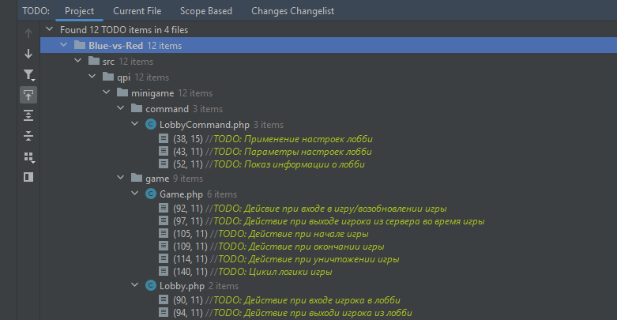

# LobbyManager
Готовая система лобби для мини-игр Minecraft Bedrock для ядра PocketMine-MP.
Данный репозиторий следует использовать как шаблон для ваших репозиториев с
использованием данного ресурса.

## Возможности
    
- Готовая система лобби. Реализован подбор случайных игр, а также присутствует 
возможность создавать приватные комнаты и настраивать их администраторам лобби. 
Также игроки тоже могут присоединяться к этим комнатам. Чтобы присоедениться к
случайному/приватному лобби нужно использовать команду **/play**.
- Готовая система игр. Доступно можество функций в классе Game, в которые вы можете
поместить логику определенных событий во время игры. Также в этом же классе
присутсвует тело цикла игры.
- Предусмотрено что игрок может выйти во время игры. Все его параметры остаются
в памяти до конца его игры (инвентарь, позиция, класс PlayerData). После возвращения
игрока на сервер его автоматически переносит в игру.

## Требования

- PMMP API >= 4.0.0
- Наличие плагина FormConstructor (находится в папке lib)
- Параметр `player.save-player.data=false` в конфиге pocketmine.yml (Рекомендуемо)
- Ваш сервер должен пускать только игроков с xbox-аккаунтами

## Использование

В коде внутри проекта расставлены TODO метки, где вы можете вставлять логику вашей мини-игры. В phpStorm в разделе TODO можно увидеть все метки.
